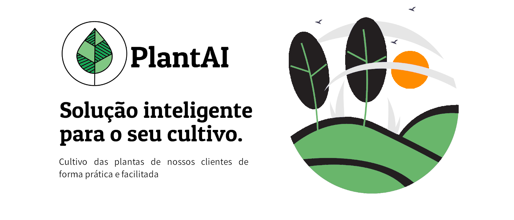

  

  

  
  
    
   
   

  

 

<h1 align="center">
    
</h1>

<h2 align="center"> 🌱 PlantAI 🌱</h2>

 <a href="#-sobre-o-projeto">Sobre</a> •
 <a href="#-funcionalidades">Funcionalidades</a> •
 <a href="#-layout">Layout</a> • 
 <a href="#-como-executar-o-projeto">Como executar</a> • 
 <a href="#-tecnologias">Tecnologias</a> • 
 <a href="#-contribuidores">Contribuidores</a> • 
 <a href="#-autor">Autores</a> • 
 <a href="#user-content--licença">Licença</a>

## 💻 Sobre o projeto

♻️ PlantAI - é um projeto que visa potencializar o cultivo de agricultores de forma prática e facilitada, propondo soluções de problemas através do reconhecimento de imagem utilizando inteligencia artificial entre outras tecnologias que compõe a industria 4.0.

Projeto desenvolvido durante o ano de 2020.2 e 2021.1 no **Projeto Integrador** oferecido pelo [IFB - Campus Brasília](https://www.ifb.edu.br/brasilia).
O Projeto Integrador é uma experiência com duração de dois semestres de desenvolvimento de projetos no curso técnico em informática integrado ao ensino médio. Com muito conteúdo prático, desafios e hacks.

---

## ⚙️ Funcionalidades

- Categorização de doenças
- Proposta de soluções para pragas

---

## 🎨 Layout

O layout da aplicação está disponível no Figma:

### Mobile

  
  
  

### Web

  

  

---

## 🚀 Como executar o projeto

Este projeto é divido em cinco partes:
1. Backend site (pasta root) 
2. Frontend (pasta src)
3. Mobile (pasta src/app)
4. Modelo ML (pasta src/model)
5. Backend APIs (pasta src/api)

💡Tanto o Frontend quanto o Mobile precisam que os Backends estejam sendo executados para funcionar.

### Pré-requisitos

Antes de começar, você vai precisar ter instalado em sua máquina as seguintes ferramentas:
[Git](https://git-scm.com), [Node.js](https://nodejs.org/en/). 
Além disto é bom ter um editor para trabalhar com o código como [VSCode](https://code.visualstudio.com/)

---

## 🛠 Tecnologias

As seguintes ferramentas foram usadas na construção do projeto:

#### **Website**

-   **[Bootstrap 5](https://github.com/ReactTraining/react-router/tree/master/packages/react-router-dom)**
-   **[CSS3](https://react-icons.github.io/react-icons/)**
-   **[HTML5](https://github.com/axios/axios)**
-   **[JavaScript](https://react-leaflet.js.org/en/)**
-   **[Flag Icon 2.3.1](https://react-leaflet.js.org/)**

#### **Server**  ([NodeJS](https://nodejs.org/en/)  +  [Flask](https://www.typescriptlang.org/))

-   **[Express](https://expressjs.com/)**

#### **Mobile**  ([React Native](http://www.reactnative.com/)  +  [TypeScript](https://www.typescriptlang.org/))

-   **[Expo](https://expo.io/)**
-   **[Expo Google Fonts](https://github.com/expo/google-fonts)**
-   **[React Navigation](https://reactnavigation.org/)**
-   **[React Native Maps](https://github.com/react-native-community/react-native-maps)**
-   **[Expo Constants](https://docs.expo.io/versions/latest/sdk/constants/)**
-   **[React Native SVG](https://github.com/react-native-community/react-native-svg)**
-   **[Axios](https://github.com/axios/axios)***

#### **Utilitários**

-   Editor:  **[Visual Studio Code](https://code.visualstudio.com/)**  → Extensions:  **[SQLite](https://marketplace.visualstudio.com/items?itemName=alexcvzz.vscode-sqlite)**
-   Teste de API:  **[PostMan](https://insomnia.rest/)**
-   Fontes:  **[Patua One](https://fonts.google.com/specimen/Ubuntu)**,  **[Noto Sans](https://fonts.google.com/specimen/Roboto)**

---

## 👨‍💻 Contribuidores

💜 Um super thanks 👏 para essa galera que fez esse produto sair do campo da ideia e entrar nas lojas de aplicativos :)

<table>
  <tr>
  </tr>
</table>

## 💪 Como contribuir para o projeto

1. Faça um **fork** do projeto.
2. Crie uma nova branch com as suas alterações: `git checkout -b my-feature`
3. Salve as alterações e crie uma mensagem de commit contando o que você fez: `git commit -m "feature: My new feature"`
4. Envie as suas alterações: `git push origin my-feature`
> Caso tenha alguma dúvida confira este [guia de como contribuir no GitHub](./CONTRIBUTING.md)

---

## 🦸 Autor

<a href="">
 
  
 <b>Wanghley Martins</b></a> <a href="https://linkedin.com/in/wanghley" title="Title">🚀</a>
  

  

---

## 📝 Licença

Este projeto esta sobe a licença [MIT](./LICENSE).

Feito com ❤️ pela equipe PlantAI 👋🏽 [Entre em contato!](https://www.linkedin.com/in/wanghley/)

---